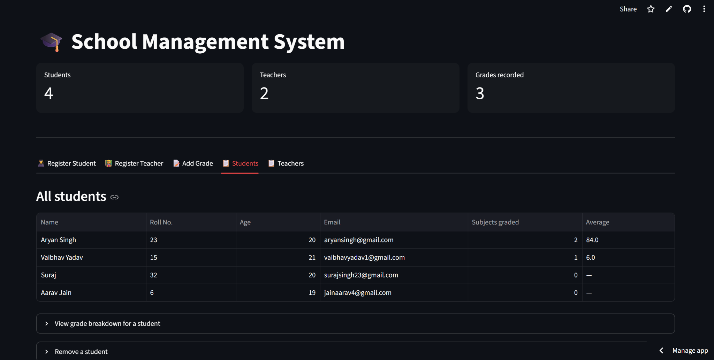

# 🎓 Student Management System

A Python-based Student Management System for managing student and teacher records, student grades, and persistent data storage.

## 🌐 Live Demo

**[Open the deployed application](https://studentdbmanagement.streamlit.app/)**

## 📸 Application Preview



## ✨ Features

* Register students
* Register teachers
* Add and update student grades
* Calculate student average marks
* View student grade breakdown
* Delete student records
* Delete teacher records
* Validate email addresses
* Prevent duplicate student roll numbers
* Prevent duplicate teacher employee IDs
* Persist data using JSON storage

## 🧠 Backend Design

The application uses Object-Oriented Programming to organize the core management logic.

### `Person`

An abstract base class providing common functionality for users.

* Defines the `get_role()` abstract method
* Provides email validation

### `Student`

Handles student-related operations:

* Student registration
* Grade management
* Student deletion
* Roll-number validation

### `Teacher`

Handles teacher-related operations:

* Teacher registration
* Teacher deletion
* Employee-ID validation

## 💾 Data Storage

Student and teacher records are persistently stored in:

```text
school_data.json
```

The application loads existing records when it starts and saves changes whenever data is modified.

## 🛠️ Tech Stack

* **Python**
* **Object-Oriented Programming (OOP)**
* **JSON** — persistent data storage
* **Pandas** — data handling and tabular processing

## 📂 Project Structure

```text
StudentDBManagement/
│
├── app.py
├── main.py
├── school_data.json
├── requirements.txt
├── dashboard.png
└── README.md
```

## ⚙️ How It Works

```text
User Input
    ↓
Student / Teacher Classes
    ↓
Validation
    ↓
Data Operations
    ↓
school_data.json
    ↓
Updated Records
```

The application separates the core data-management logic from the application interface. Student and teacher operations are handled through dedicated classes, while JSON provides persistent storage.

## 🚀 Running Locally

Install the required dependencies:

```bash
pip install -r requirements.txt
```

Run the application:

```bash
streamlit run app.py
```
